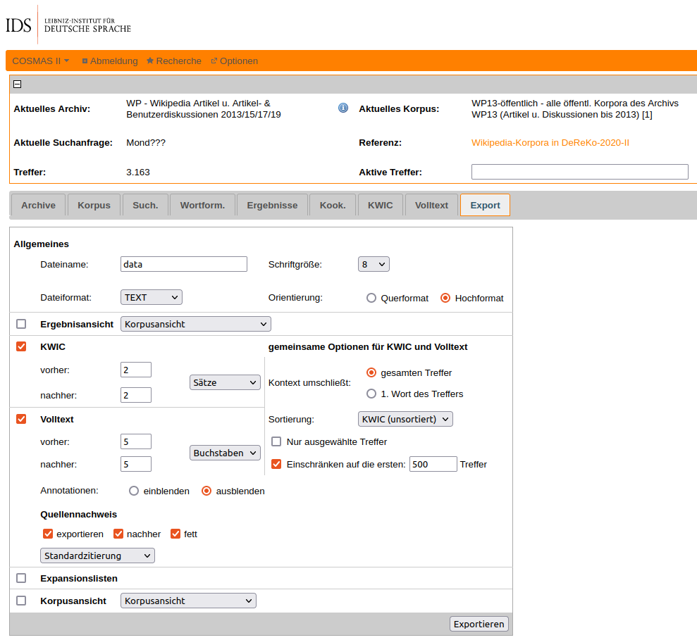

# COSMAS2-Reader

## Description

COSMAS2-Reader is an R Shiny application for formatting a COSMAS II exported text file. [COSMAS  II](http://www.ids-mannheim.de/cosmas2/,) i.e. the *Corpus Search, Management and Analysis System* is delevoped and maintained by the Leibniz-Institut für Deutsche Sprache at Mannheim.

This project was developed to simplify the process for both scientists and students who want to utilize the IDS corpora.

The format of text files exported from the online COSMAS II interface can be challenging to convert into a table format. Transforming the data into a tabular structure that includes tokens and their contexts is valuable for annotation purposes, especially when you need to perform quick and limited-scale annotations, such as in student research projects or when validating intuitions related to a specific  phenomenon.

This application is designed to simplify the process of using the corpora, saving users time, and breaking down potential barriers. It requires no programming skills and removes the need for a lot of manual copying and pasting. To my knowledge, this is the only project that offers this capability.

## Installation

To run this application locally, you need to install [R](https://cran.r-project.org/) and the packages: dplyr, ggplot2, purrr, readr, shiny, shinythemes, stringr, tidyr, wordcloud2.

You can also access it remotely: [anna-pryslopska.shinyapps.io/COSMAS2-Reader](https://anna-pryslopska.shinyapps.io/COSMAS2-Reader/)

The current COSMAS2-Reader version is compatible with version 2.4.2 of the web-based user interface of COSMAS II.

## Usage

**tl;dr:** for the app to work and not crash:

- The file must have been exported as TXT
- The file must have KWIC information
- You must know where the source reference (*Quellennachweis*) is in the file (before, after, absent)
- You must know what the context (*Volltext*) is (letter, word, sentence, phrase)

* * * * *

To use the reader, upload a plain text file as exported by the COSMAS interface. The data format (*Dateiformat*) should be **TEXT**. If the uploaded file was saved as a different format and converted to plain text, this program will likely crash.

Crucially, the file must contain the  **Key Word in Context (KWIC)** information. Before exporting the search results in COSMAS, make sure that the *KWIC* checkbox is selected. The length of the context before and after the KWIC can be arbitrary (2 sentences left and right in the image below).

Another important information is **Volltext**, i.e. whether the token is exported with the context of letters (*Buchstaben*), words (*Wörter*), sentences (*Sätze*), or paragraphs (*Absätze*). This is set to 5 letters before and after in the image below.

Lastly, the position of the **source reference** (*Quellennachweis*) should be noted: present or not (*exportieren* vs unchecked) and before or after (unchecked or *nachher*).

To use the COSMAS II reader, browse and select the exported corpus text file (`data.TXT` in the image above). The file size should not exceed 30MB. Then choose where the **source reference** information is located (absent, before, or after) and what the token context (**Volltext**) is: letters, words, sentences, or paragraphs. Click *Submit* to process the file.

You should see a preview of the formatted table, an overview of the tokens, and a wordcloud of the accompaning context. You can download the table in the preview as a csv file by clicking on *Download*.

If any of these information are wrong, then the application might crash or freeze. In this case, restart it. If you forgot which export settings you chose, you can look them up in the fil

## Credits

COSMAS2-Reader was created by Anna Pryslopska as part of her doctoral thesis.
